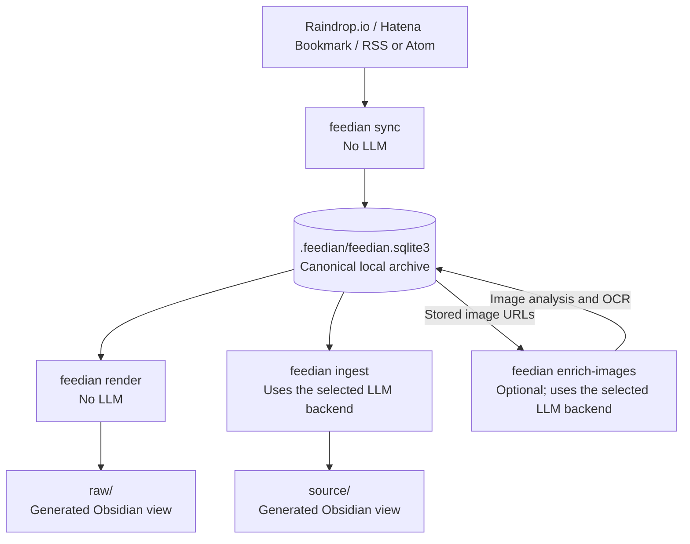

# Feedian


[](LICENSE)

Feedian collects bookmarks and feeds into a per-Obsidian-vault SQLite archive, renders the collected material as `raw/` Markdown, and optionally uses an LLM backend — the OpenAI API, the Manus API, or a locally installed Codex or Claude Code CLI — to create summarized and tagged `source/` notes.

Supported providers are Raindrop.io, Hatena Bookmark, and RSS/Atom. Public Hatena comments can be attached to URLs collected from **any** provider.

Two words are used precisely throughout this document. A **provider** is a place material is collected from: Raindrop.io, Hatena Bookmark, or an RSS/Atom feed. A **backend** is how an LLM request is executed: `openai-responses`, `manus-api`, `codex-local`, or `claude-code-local`.

## Scope

Feedian aims at everyday usefulness rather than completeness. It keeps a working archive of what you
actually read — not an academic dataset, and not a full snapshot service like archive.today. Pages
that cannot be fetched or extracted are recorded as such and set aside, so that a routine run stays
fast and worth running.

## How it works



- `.feedian/feedian.sqlite3` is the canonical local archive.
- `raw/` and `source/` are generated Obsidian views.
- `sync`, `render`, `run`, comment retrieval, star enrichment, search, and snapshots do not call an LLM.
- `enrich-images` asks the selected LLM backend to classify raster images and transcribe explanatory ones. It is optional.
- `ingest` asks the selected LLM backend for a title, summary, key points, content type, and one to six tags; stored image OCR is included when available.
- Extracted HTML text is retained, but the original HTML is discarded. Non-HTML response bytes such as PDFs are retained for later re-extraction. Page image URLs are stored; image bytes are not downloaded.
- `enrich-images` downloads image bytes only into temporary files and removes them after analysis; the archive keeps the image URL, analysis state, and OCR text.

## Documentation

| Where | What it answers |
| --- | --- |
| This README | How to install, configure, and run Feedian. |
| [`DESIGN.md`](DESIGN.md) | How Feedian behaves now, subsystem by subsystem. |
| [`docs/specs/`](docs/specs/) | Why individual decisions were made, and which alternatives were rejected. |
| [`docs/reviews/`](docs/reviews/) | Code reviews, their findings, and whether each was accepted. |

`DESIGN.md` is the only place that describes current behaviour; a specification records the reasoning behind one decision at the time it was made.

## Quick start

### 1. Install

```powershell
git clone https://github.com/tsunyan/feedian.git
cd feedian
py -3.11 -m venv .venv
.\.venv\Scripts\python.exe -m pip install -r requirements.txt
.\.venv\Scripts\python.exe -m pip install -e .
.\.venv\Scripts\python.exe -m playwright install chromium --only-shell
```

Installing the project provides the `feedian` command, which every example below uses. Activate the virtual environment to put it on `PATH`:

```powershell
.\.venv\Scripts\Activate.ps1
```

To use it from any directory without activating anything, add a function to your PowerShell profile (`$PROFILE`) instead:

```powershell
function feedian { & "C:\path\to\feedian\.venv\Scripts\feedian.exe" @args }
```

### 2. Set credentials

Copy `.env.example` to `.env`, then fill in only the providers you enable and the backend you use:

```dotenv
RAINDROP_TOKEN=your-raindrop-token
HATENA_ID=your-hatena-id
HATENA_API_KEY=your-hatena-api-key
OPENAI_API_KEY=your-openai-api-key
OPENAI_MODEL=gpt-5.6-terra
```

`OPENAI_API_KEY` is needed only when the `openai-responses` backend must make a new API call. `OPENAI_MODEL` is optional and overrides that backend's default model. RSS needs no credential. Do not commit `.env`.

Feedian reads `.env` from the current directory first, then a per-user file:

| Path | When it is used |
| --- | --- |
| `./.env` | Running from the repository or any directory holding a `.env`. |
| `%APPDATA%\Feedian\.env` (Windows), `$XDG_CONFIG_HOME/feedian/.env` or `~/.config/feedian/.env` | Any working directory, including scheduled runs. |

Real environment variables win over both, and the working-directory file wins over the per-user file. Because commands can select a Vault from anywhere, put credentials in the per-user file if you run Feedian from outside the repository — `feedian schedule` tasks start in an arbitrary directory and would otherwise find no `.env`. Keep credentials out of the Vault itself: a Vault is a Git repository that `snapshot` commits and pushes.

Each backend authenticates differently:

| Backend | Credential | Notes |
| --- | --- | --- |
| `openai-responses` | `OPENAI_API_KEY` | The built-in default backend. |
| `manus-api` | `MANUS_API_KEY` | Sent as the `x-manus-api-key` header. Uses the structured output API. |
| `codex-local` | None in `.env` | Run `codex login` once in Feedian's own `CODEX_HOME` (`~/.feedian/codex-home`), which leaves your usual `~/.codex` untouched. Feedian never passes an LLM API key to the CLI. |
| `claude-code-local` | `ANTHROPIC_API_KEY`, or `ANTHROPIC_AUTH_TOKEN` with an `ANTHROPIC_BASE_URL` gateway | Set exactly one of the two, never both. OAuth and subscription authentication are not used. |

To use Manus instead of OpenAI, set the credential and select the backend:

```dotenv
MANUS_API_KEY=your-manus-api-key
LLM_BACKEND=manus-api
# MANUS_MODEL=manus-1.6
```

Selecting a backend for one run is `feedian ingest --backend manus-api`. Selecting it permanently belongs in the Vault's `llm.backend`, described under [Vault config fields](#vault-config-fields). `enrich-images` has no backend flag and always uses the Vault configuration.

Manus runs as a remote agent task rather than a single request. Feedian cannot stop a task it has started, so every Manus failure message carries the `task_id` and `task_url`; if a run fails or times out, open that URL to check whether the task is still running.

For Hatena, the API key is the key shown in the [posting email address settings](https://www.hatena.ne.jp/my/config/mail/upload), not the account password. If the address is shown as `API_KEY.HATENA_ID@...`, use the `API_KEY` part.

### 3. Initialize a Vault

```powershell
feedian init --vault "D:\GitHub\MyVault" --set-default
feedian migrate
```

`--set-default` lets later commands omit `--vault`. Edit `D:\GitHub\MyVault\.feedian\config.json` to disable unused providers or add RSS feeds before the first sync.

### 4. Collect and inspect raw material

```powershell
# A small first pass; this writes only the SQLite archive.
feedian sync --source all --limit 20

# Render into .feedian/staging/raw for inspection.
feedian render

# After inspection, publish the generated raw view into raw/.
feedian render --apply
```

`render --apply` protects files that are not unchanged Feedian-generated documents. It reports a conflict rather than overwriting a legacy or hand-edited note.

### 5. Extract text from explanatory images (optional)

`sync` records candidate image URLs. `enrich-images` fetches those images, ignores photos, decorative illustrations, icons, logos, and advertisements, and stores original-language OCR only for explanatory images such as charts, diagrams, tables, slides, document scans, and UI screenshots.

```powershell
# Inspect the backlog and request count without downloading images or calling an LLM.
feedian enrich-images --limit 20 --dry-run

# Process up to 20 resources.
feedian enrich-images --limit 20
```

Exactly one of `--limit N` or `--all` is required. Start with a limit; use `feedian enrich-images --all` only when you intentionally want to process the complete eligible backlog. The selected `llm.backend` must support image analysis: `openai-responses`, `codex-local`, and `claude-code-local` do; `manus-api` does not.

Stored OCR is included as untrusted original-language context in later `ingest` requests. Running `ingest` without this optional step is also supported.

Adding OCR to a resource that already has a summary changes its request, so the stored summary is no longer reused. Refresh those with `feedian ingest --stale`; `--auto` skips resources that already have a source note, and a plain `--limit` takes the oldest resources rather than the changed ones.

### 6. Preview and run LLM ingest

```powershell
# No API calls and no writes.
feedian ingest --auto --dry-run --limit 20

# Create representative source notes.
feedian ingest --auto --limit 20
```

The dry run shows the selected resources, locally counted input tokens, a maximum estimate, and—after at least one matching completed run—an expected estimate based on actual output/input usage for that model.

During a real run, the progress display shows cumulative input tokens, output tokens, and estimated USD cost. Each successful item is recorded immediately, so stopping and rerunning continues by reusing completed results instead of making duplicate API calls. Do not use `--force` when resuming.

## Command reference

Run `feedian --help` for the command overview or `feedian COMMAND --help` for terminal help. The complete modern command set is summarized here.

### `init`

Initialize Feedian state in an existing Obsidian Vault.

```powershell
feedian init --vault PATH [--set-default]
```

| Option | Meaning |
| --- | --- |
| `--vault PATH` | Required Vault root. |
| `--set-default` | Save this Vault as the default for the current user. |

It creates `.feedian/config.json` and `.feedian/.gitignore`; it does not scan or rewrite existing notes.

### `config set-default-vault`

```powershell
feedian config set-default-vault PATH
```

Select an already initialized Vault as the user default.

### `status`

```powershell
feedian status [--vault PATH]
```

Show resolved paths, enabled providers, database integrity and schema version, record counts, and the latest sync status. The `unreachable` count is how many pages Feedian has stopped retrying because they answered with a terminal status; `sync --full --force-fetch` tries them again.

### `migrate`

```powershell
feedian migrate [--vault PATH]
```

Create or upgrade the Vault database, run integrity checks, compact it, and rebuild the disposable search index. Before a schema upgrade, Feedian creates a SQLite-consistent temporary backup and removes it only after verification succeeds.

### `sync`

```powershell
feedian sync [--vault PATH] [--source all|raindrop|hatena|rss] [--limit N]
             [--quick | --full]
             [--skip-page-fetch] [--skip-comments]
             [--force-fetch] [--force-comments]
             [--progress auto|rich|plain|off] [--verbose]
```

Collect provider metadata and linked-page content into SQLite without calling an LLM.

| Option | Meaning |
| --- | --- |
| `--source` | Provider to collect; default `all` means every enabled provider. |
| `--limit N` | Maximum items per selected provider. Useful for a staged first run. |
| `--quick` | Default. Collect only new items and bodies never fetched, stopping early once known items appear. |
| `--full` | Process every item, including ones already stored. Required by both force options. |
| `--skip-page-fetch` | Store provider metadata without downloading linked-page content. |
| `--skip-comments` | Do not check or retrieve public Hatena comments. |
| `--force-fetch` | Check pages now, ignoring `fetch.refresh_days`. When a site supports it, unchanged pages return HTTP 304 and their content is not downloaded again. **Requires `--full`.** |
| `--force-comments` | Retrieve full Hatena comments even when the public bookmark count is unchanged. **Requires `--full`.** |
| `--progress` | `auto` uses Rich in a terminal and plain output elsewhere; it can be overridden. |
| `--verbose` | Print each processed source item title. |

#### Quick and full

A quick sync touches only what it has never seen: items with no stored record, and stored resources whose page was never fetched. It stops walking a provider once it has passed known items, which is what makes a routine run cheap — on an unchanged Vault, Hatena collection drops from dozens of requests to two.

The cost is that quick does not notice things that changed behind items it already has: provider-side metadata edits, comments appearing or disappearing, pages due for a refresh under `fetch.refresh_days`, and earlier fetch failures that would now succeed. None of these are corrected automatically, and quick is never promoted to full on its own — the mode is fixed when the run starts. Run `--full` on a schedule, which is what `feedian run` does.

`--force-fetch` and `--force-comments` mean "fetch known items again", which directly contradicts quick's "do not touch known items", so they are rejected without `--full` rather than silently changing the mode. For `--source rss` the two modes barely differ, because a feed only ever exposes a bounded recent window.

The reasoning and the rejected alternatives are in [`DESIGN.md`](DESIGN.md#syncのモード) and [syncのquickモード](docs/specs/20260818-sync-quick-mode.ja.md).

Hatena comment handling applies to every processed item with a URL, including Raindrop and RSS items—not only bookmarks collected from Hatena. Feedian checks bookmark counts in batches, retrieves full comments for new or changed entries, enriches star totals, and keeps at most 20 public comments per resource, ordered by stars and then age. `--limit` and `--source` also limit which items are considered during that sync.

RSS 2.0, RSS 1.0/RDF, and Atom feeds are accepted. Feedian also understands common namespaced fields such as `content:encoded` and `dc:date`, resolves relative article URLs, and uses embedded feed content when no downloaded article revision exists. With multiple feeds, a failed feed is recorded while the remaining feeds continue; `--limit` selects the newest entries across the complete RSS provider rather than filling the limit from the first feed only. Stored `ETag` and `Last-Modified` values are reused for conditional requests, so unchanged feeds can return `304 Not Modified` without being parsed again.

### `enrich-images`

```powershell
feedian enrich-images [--vault PATH] (--limit N | --all) [--dry-run] [--force]
                      [--progress auto|rich|plain|off]
```

Fetch stored candidate images, classify them, and save original-language OCR for explanatory images. Photos, decorative illustrations, icons, logos, and advertisements are ignored. The command uses the backend and model selected in the Vault's `llm` configuration.

| Option | Meaning |
| --- | --- |
| `--vault PATH` | Vault root. Defaults to the current or configured Vault. |
| `--limit N` | Process at most N eligible resources, oldest revision first. Mutually exclusive with `--all`. |
| `--all` | Process every currently eligible resource. Mutually exclusive with `--limit`. |
| `--dry-run` | Show the remaining resources, candidate images, reusable results, fetch URLs, analysis groups, effective parallelism, and timing from past runs without requests or writes. |
| `--force` | Re-fetch and re-analyze selected candidates. Cheap local gates still apply. |
| `--progress` | Select Rich, plain, automatic, or disabled progress output. |

The command evaluates all candidate images recorded for each selected resource. Download size, decoded dimensions, and image type are checked locally before an LLM request. SVG files are not rendered; safe text from their XML `<text>` elements is extracted locally. Results are reusable across runs, and failures remain visible in the final report. OCR text is stored in SQLite rather than written directly to Markdown, then supplied to a later `ingest` run within the per-image and per-resource limits set by `image_ocr.max_ocr_images_per_resource` and `image_ocr.max_ocr_chars_per_resource`.

### `render`

```powershell
feedian render [--vault PATH] [--apply] [--progress auto|rich|plain|off]
```

Render SQLite records as Obsidian Markdown. Without `--apply`, output goes to `.feedian/staging/raw/`. With `--apply`, output goes to the configured `raw_folder` and protected-file conflicts are reported without overwriting those files.

### `ingest`

```powershell
feedian ingest [--vault PATH] [--backend BACKEND] [--model MODEL] [--language LANGUAGE] [--limit N]
               [--dry-run] [--auto | --stale] [--force]
               [--progress auto|rich|plain|off]
```

Create LLM-derived `source/` notes from resources already stored by `sync`.

| Option | Meaning |
| --- | --- |
| `--backend BACKEND` | Backend for this run: `openai-responses`, `manus-api`, `codex-local`, or `claude-code-local`. Overrides `LLM_BACKEND` and the Vault's `llm.backend`. |
| `--model MODEL` | Model for this run. Overrides the selected backend's environment variable and, as described under [Backend and model selection](#backend-and-model-selection), is the only way to pair a specific model with a one-off backend. |
| `--language LANGUAGE` | Output language; default `Japanese`. |
| `--limit N` | Maximum candidates to process. Without `--auto`, omitted means all stored resources. |
| `--dry-run` | Show selection, token counts, and cost estimates without API calls or writes. |
| `--auto` | Choose representative resources, prioritizing uncovered fields and then large fields. Source tags are used first, with title terms and domain as fallbacks. |
| `--stale` | Choose only resources with no reusable result for the current request, including those whose stored image OCR changed. Mutually exclusive with `--auto`. |
| `--force` | Ignore reusable successful LLM results and call the API again. This can incur duplicate cost. |
| `--progress` | Select Rich, plain, automatic, or disabled progress output. |

`--provider openai|manus` is still accepted as a deprecated alias of `--backend` and is not shown in `--help`. Use the backend names.

`--auto` defaults to 20 candidates when `--limit` is omitted. A normal run reuses a matching successful result for the same content revision, model, prompt version, and request fingerprint. Because stored image OCR is part of that fingerprint, a resource enriched after its last summary no longer matches; `--stale` selects exactly those. Plain `--limit N` takes the oldest N resources rather than the changed ones, and `--auto` skips every resource that already has a source note, so neither refreshes newly enriched summaries. Each completed resource is marked in SQLite, allowing repeated stop-and-resume runs to advance without duplicating completed work.

LLM tags are stored in the `source/` note frontmatter and `## Tags` section. Provider tags collected by `sync` remain separate in raw metadata and are also supplied to the LLM as context.

The displayed cost is a local estimate from Feedian's price snapshot; account credits, complimentary tokens, taxes, and the amount the service finally bills are not known to Feedian.

Feedian's price snapshot covers OpenAI models only, and Manus reports no token usage. A run whose cost cannot be computed shows `n/a` for cost and tokens rather than zero, and the summary line reports `unpriced_requests` and `unmetered_requests` counts. `n/a` means "not reported", never "free".

Whatever the backend returns is re-checked against Feedian's own schema before a note is written: field types are corrected, and title, summary, key point, and tag lengths and counts are capped. OpenAI enforces this schema itself, but Manus supports only a subset of it, so the check is what keeps a malformed Manus response out of `source/`. A response with no usable title or summary fails that resource, leaving it for the next run instead of writing a hollow note.

### `enrich-stars`

```powershell
feedian enrich-stars [--vault PATH] [--limit N] [--refresh-days N] [--force]
                     [--progress auto|rich|plain|off]
```

Refresh public Hatena Star totals for stored comments without an LLM. The default refresh age comes from `fetch.star_refresh_days` (30 days when omitted). `--force` refreshes every stored Hatena comment now.

### `reextract`

```powershell
feedian reextract [--vault PATH] [--media-type PREFIX] [--limit N]
```

Re-run text extraction from retained non-HTML response bytes without downloading the source again. For example:

```powershell
feedian reextract --media-type application/pdf
```

HTML cannot be re-extracted this way because only its extracted text is retained; use `sync --force-fetch` to fetch HTML again.

### `search`

```powershell
feedian search status [--vault PATH]
feedian search rebuild [--vault PATH]
```

Inspect or rebuild `.feedian/cache/search.sqlite3`. This full-text index is disposable and is excluded from Git and snapshots.

### `run`

```powershell
feedian run [--vault PATH] [--if-due] [--skip-snapshot]
```

Run the due non-LLM pipeline: sync due providers, refresh due Hatena stars, rebuild search, apply the raw render, and create a due weekly snapshot.

| Option | Meaning |
| --- | --- |
| `--if-due` | Exit without work if no provider or snapshot is due. Used by the logon catch-up task. |
| `--skip-snapshot` | Run sync, star enrichment, search, and render without creating a snapshot. |

`run` never invokes `ingest` and therefore never calls an LLM.

### `schedule`

```powershell
feedian schedule install [--vault PATH] [--time HH:MM]
feedian schedule status [--vault PATH]
feedian schedule remove [--vault PATH]
```

Manage Windows Task Scheduler jobs. `install` creates a six-hourly task starting at local `03:00` by default and a logon catch-up task that runs with `--if-due`. Failed scheduled runs retry every 30 minutes, up to six attempts.

### `snapshot`

```powershell
feedian snapshot [--vault PATH] [--dry-run] [--progress auto|rich|plain|off]
```

Publish a verified SQLite archive to a GitHub Release. `--dry-run` checks prerequisites without creating a commit, tag, archive, or Release.

Snapshot prerequisites:

- The Vault is a Git repository whose `origin` is GitHub.
- The GitHub repository is private; Feedian refuses public repositories.
- [GitHub CLI](https://cli.github.com/) is installed and authenticated.
- [7-Zip](https://www.7-zip.org/) is installed, or `FEEDIAN_7Z` points to it.
- The Git staging area has no unrelated staged files.

A real snapshot creates a consistent database backup, archives it, commits managed Vault paths, pushes a tag, uploads a private Release asset, downloads it again, and verifies hashes, archive integrity, and SQLite integrity.

### `restore`

```powershell
feedian restore --vault PATH --tag TAG [--archive FILE]
```

Restore a verified snapshot. `--tag` is always required: verification reads `.feedian/snapshot.json` as it was committed and tagged in the Vault's own Git history (not the copy bundled inside the archive), and checks the archive's sha256 against that value before extracting anything. With `--archive`, restore from that local `.sqlite3.7z` file, verified against `--tag`'s Git-tagged manifest. Without it, download the archive from `--tag`'s GitHub Release first (fetching the tag from `origin` if it isn't local yet), then restore the same way. The destination Vault must not already contain `.feedian/feedian.sqlite3`.

## Vault and configuration selection

Modern commands use the Vault-local `.feedian/config.json`. Feedian chooses the Vault in this order:

1. `--vault PATH`
2. The current directory or its nearest parent containing `.feedian/config.json`
3. The user default set by `init --set-default` or `config set-default-vault`

There are two different config formats in this repository:

- `<vault>/.feedian/config.json`: current SQLite/Vault workflow; used by every modern command in the reference above.
- Repository-root `config.json`: legacy direct-export workflow only; it is **not** read by `feedian ingest`.

### Backend and model selection

For `ingest`, the backend is selected in this order:

1. `--backend BACKEND`
2. `LLM_BACKEND` from the environment or `.env`
3. `llm.backend` in the Vault config

The Vault config is the real default, not a built-in constant. `feedian init` writes `llm.backend` as `openai-responses`, so an untouched Vault uses OpenAI. `--provider` and `LLM_PROVIDER` are still accepted as deprecated aliases of the first two; new configuration should use the backend names.

The model is then selected in this order:

1. `--model MODEL`
2. The selected backend's environment variable
3. `llm.model` in the Vault config, **only when the selected backend is the configured one**
4. The backend's built-in default

Step 3 is worth reading twice. `llm.model` belongs to `llm.backend`, so overriding the backend for one run also drops the configured model and falls through to step 4. Pass `--model` when you want a specific model with a one-off backend.

| Backend | Environment variable | Built-in default model |
| --- | --- | --- |
| `openai-responses` | `OPENAI_MODEL` | `gpt-5.6-terra` |
| `manus-api` | `MANUS_MODEL` | `manus-1.6` |
| `codex-local` | `CODEX_MODEL` | `gpt-5.6-terra` |
| `claude-code-local` | `ANTHROPIC_MODEL` | `claude-sonnet-5` on the official endpoint; none for a compatible endpoint set with `ANTHROPIC_BASE_URL`, where a model must be given explicitly or the run fails. |

The active backend and model are shown in the ingest preview and execution header.

`enrich-images` takes no backend or model flag. It always uses the Vault's `llm.backend` and `llm.model`.

### Vault config fields

`feedian init` creates exactly this structure:

```json
{
  "format_version": 4,
  "raw_folder": "raw",
  "source_folder": "source",
  "review_folder": "review",
  "providers": {
    "raindrop": {
      "folder": "Raindrop",
      "enabled": true,
      "poll_hours": 168
    },
    "hatena": {
      "folder": "Hatena",
      "enabled": true,
      "poll_hours": 168
    },
    "rss": {
      "folder": "RSS",
      "enabled": false,
      "poll_hours": 6,
      "layout": "feed/year/month"
    }
  },
  "fetch": {
    "html_max_bytes": 10485760,
    "document_max_bytes": 104857600,
    "refresh_days": 30,
    "workers": 8,
    "comment_workers": 8,
    "star_refresh_days": 30,
    "allow_private_hosts": [],
    "retry_base_minutes": 30,
    "retry_max_days": 30,
    "terminal_http_statuses": [
      404,
      410
    ],
    "terminal_failure_kinds": [
      "dns",
      "timeout"
    ],
    "terminal_kind_failures": 3,
    "timeout_seconds": 5,
    "browser_timeout_seconds": 30
  },
  "llm": {
    "backend": "openai-responses",
    "model": "gpt-5.6-terra",
    "workers": 8,
    "fallback": {
      "enabled": false,
      "backend": "",
      "model": ""
    }
  },
  "image_ocr": {
    "workers": 8,
    "timeout_seconds": 15,
    "max_bytes": 20971520,
    "max_pixels": 40000000,
    "min_short_edge_pixels": 200,
    "max_long_edge_pixels": 1024,
    "max_ocr_chars_per_image": 2000,
    "max_ocr_images_per_resource": 8,
    "max_ocr_chars_per_resource": 10000,
    "ignore_name_tokens": [
      "2x",
      "3x",
      "avatar",
      "badge",
      "banner",
      "blank",
      "bnr",
      "btn",
      "button",
      "emoji",
      "favicon",
      "icon",
      "logo",
      "profile",
      "spacer",
      "sprite"
    ],
    "ignore_url_prefixes": [
      "b.hatena.ne.jp/bc/",
      "b.hatena.ne.jp/entry/image/",
      "i.ytimg.com/vi/",
      "lh3.googleusercontent.com/a/",
      "pbs.twimg.com/amplify_video_thumb/",
      "pbs.twimg.com/card_img/",
      "pbs.twimg.com/cards/",
      "pbs.twimg.com/ext_tw_video_thumb/",
      "pbs.twimg.com/media/",
      "pbs.twimg.com/tweet_video_thumb/",
      "profile-image.kraken.asahi.com/"
    ]
  }
}
```

RSS subscriptions and category routes are added by editing that file. An entry may be a bare URL string or an object:

```json
"rss": {
  "folder": "RSS",
  "enabled": true,
  "poll_hours": 6,
  "layout": "feed/year/month",
  "feeds": [
    "https://example.com/feed.xml",
    {
      "url": "https://example.net/atom.xml",
      "name": "Example Tech",
      "folder": "Example Tech",
      "tags": ["technology"],
      "route": "reading"
    }
  ],
  "category_routes": {
    "AI": "technology/ai",
    "Security": "technology/security"
  }
}
```

| Field | Meaning |
| --- | --- |
| `raw_folder`, `source_folder`, `review_folder` | Relative output folders inside the Vault. |
| `providers.<name>.folder` | Provider subfolder under `raw_folder`. |
| `providers.<name>.enabled` | Include the provider in `sync --source all` and scheduled runs. |
| `providers.raindrop.collection_id` | Optional Raindrop collection ID; omitted means all bookmarks. |
| `providers.<name>.poll_hours` | Minimum interval used by `run` to decide whether that provider is due. |
| `providers.rss.feeds` | RSS/Atom subscriptions. Each entry may be a URL string or an object with `url`, `name`, `folder`, `tags`, `route`, and `enabled`. |
| `providers.rss.layout` | RSS raw-note layout: `flat`, `feed`, `feed/year`, `feed/year/month` (default), or `route/feed/year/month`. |
| `providers.rss.category_routes` | Explicit feed-category-to-folder mappings. Unlisted categories never create folders automatically. |
| `fetch.html_max_bytes` | Maximum HTML download size. |
| `fetch.document_max_bytes` | Maximum retained non-HTML response size. |
| `fetch.refresh_days` | Age after which Feedian checks a linked page for updates again. |
| `fetch.workers` | Parallel workers for page fetching during `sync`. Defaults to 8. |
| `fetch.comment_workers` | Parallel workers for Hatena comment retrieval. |
| `fetch.star_refresh_days` | Default age for refreshing Hatena Star counts. |
| `fetch.allow_private_hosts` | Explicit private/local hosts that page fetching may access. Empty by default. |
| `fetch.retry_base_minutes` | Wait before retrying a page that failed once. Doubles with each further consecutive failure. |
| `fetch.retry_max_days` | Ceiling on that growing wait. |
| `fetch.terminal_http_statuses` | Statuses that are never retried, only `--force-fetch` gets past them. Defaults to `[404, 410]`; an empty list turns this off and lets the growing wait handle everything. |
| `fetch.terminal_failure_kinds` | Failure kinds that stop being retried once they repeat. Defaults to `["dns", "timeout"]`, meaning a host that stops resolving or stops answering. |
| `fetch.terminal_kind_failures` | Consecutive failures of such a kind before it is treated as terminal. Defaults to 3. |
| `fetch.timeout_seconds` | Page fetch connect and response timeout. Defaults to 5 seconds. |
| `fetch.browser_timeout_seconds` | Timeout for the browser fallback, which is slower by nature. Defaults to 30 seconds. |
| `fetch.quick_stop_after_known_pages` | Consecutive pages of already-stored items that end collection during a quick sync. Defaults to 1. Raising it makes quick look further past known items. |
| `llm.backend` | Backend used by `ingest` and `enrich-images` when no flag or environment variable overrides it. Defaults to `openai-responses`. |
| `llm.model` | Model for `llm.backend`. Used only while that backend is the selected one. |
| `llm.fallback.enabled`, `llm.fallback.backend`, `llm.fallback.model` | Optional second backend to retry an unavailable one. Disabled by default; see below. |
| `llm.workers` | Parallel workers for `ingest`. Defaults to 8. Each backend caps this further with its own limit; local agent backends run one at a time. |
| `image_ocr.workers` | Global parallel workers for image fetching and analysis across all resources. Defaults to 8 and is capped further by the selected backend. |
| `image_ocr.timeout_seconds` | Per-request image download timeout. Defaults to 15 seconds. |
| `image_ocr.max_bytes` | Maximum downloaded bytes per image. Defaults to 20 MiB. |
| `image_ocr.max_pixels` | Maximum decoded pixels. Defaults to 40,000,000. Pillow's decompression-bomb warning is treated as an error and decoded dimensions are checked again before pixel data is loaded. |
| `image_ocr.min_short_edge_pixels` | Ignore raster images, and SVG files that declare a size, whose shorter edge is below this. Defaults to 200 pixels. |
| `image_ocr.max_long_edge_pixels` | Raster normalization target. Defaults to 1,024 pixels. Images are never enlarged; very narrow images stay larger when needed to keep their short edge readable. |
| `image_ocr.max_ocr_chars_per_image` | Maximum stored OCR characters per image. Defaults to 2,000; truncated results are marked for later inspection. |
| `image_ocr.max_ocr_images_per_resource` | Maximum explanatory-image OCR results supplied to one `ingest` request. Defaults to 8. |
| `image_ocr.max_ocr_chars_per_resource` | Maximum total OCR characters supplied for one resource. Defaults to 10,000. |
| `image_ocr.ignore_name_tokens` | Complete lowercase ASCII path-token denylist. Hostnames, query strings, fragments, alt text, substrings, regular expressions, and globs are not matched. |
| `image_ocr.ignore_url_prefixes` | Complete `hostname/path-prefix` denylist applied to the stored source URL before fetching. Hostnames match exactly, so numbered shards must be listed separately when wanted. |

**Backend fallback** is disabled by default, and enabling it requires naming both `llm.fallback.backend` and `llm.fallback.model`. It is deliberately narrow: Feedian switches to the second backend only when the first is unavailable, rate limited, or times out. Authentication, policy, and protocol failures do not trigger it, because those mean the configuration or the implementation is wrong, and paying a second backend would only hide that. The ingest plan shows the fallback destination before a run, or `disabled` when there is none, and a fallback request is recorded as its own `llm_run` under the backend that actually served it, so the audit trail always shows which one wrote a summary.

Unknown config fields are rejected instead of silently ignored. Numeric `image_ocr` settings must be integers of 1 or more; a boolean, a decimal, or a quoted number is rejected rather than coerced. Gate arrays are normalized and deduplicated, and malformed entries are rejected.

The two image gate arrays are the Vault's complete active values, not additions to hidden code defaults. To tune a Vault, run `enrich-images --dry-run`, inspect the `ignored_reason` and host counts, then add only rules whose matched images are known to be non-explanatory. Rules such as host prefixes for `spotlight.fantia.jp`, `media.vogue.co.jp`, `dailyportalz.jp`, `nazology.kusuguru.co.jp`, and `media.loom-app.com`, or the `photo` and `storage` name tokens, are intentionally not defaults because their accuracy is Vault-dependent. Removing a rule restores a retained completed OCR locally when possible.

## Common recipes

### Grow the raw archive in stages

```powershell
feedian sync --source hatena --limit 100
feedian sync --source hatena --limit 500
feedian sync --source hatena --limit 1000
feedian render --apply
```

Existing records are updated or reused by stable source/resource identity instead of being duplicated.

### Fetch metadata only

```powershell
feedian sync --source raindrop --skip-page-fetch --skip-comments
```

### Collect RSS into feed and month folders

Enable RSS and add subscriptions under `providers.rss.feeds`, then run:

```powershell
feedian sync --source rss --limit 20 --skip-comments
feedian render
# Inspect .feedian/staging/raw/RSS/<feed>/<year>/<month>/
feedian render --apply
```

The default layout is:

```text
raw/RSS/<feed folder>/<YYYY>/<MM>/<title> - <source id>.md
```

Entries without a usable publication date go under `_undated/`. A configured feed `folder` is stable. When it is omitted, Feedian remembers the first resolved folder already stored for that feed. Changing a layout or an explicit route safely moves unchanged Feedian-generated notes and their comment notes; edited files remain in place and are reported as conflicts.

To add a controlled top-level route, set `providers.rss.layout` to `route/feed/year/month` and use either a feed's explicit `route` or `category_routes`. Ordinary feed and LLM tags stay in frontmatter and do not create arbitrary folders.

### Refresh an article and its Hatena discussion

```powershell
feedian sync --source all --full --force-fetch --force-comments
```

### Compare full and automatic ingest previews

```powershell
# All stored resources, up to 100.
feedian ingest --dry-run --limit 100

# A diverse representative selection, up to 100.
feedian ingest --auto --dry-run --limit 100
```

### Resume an interrupted ingest

Run the same command again without `--force`:

```powershell
feedian ingest --auto --limit 100
```

Matching completed results are reused. New token and cost totals in the progress display include only API calls made during the current invocation.

### Use a one-off model

```powershell
feedian ingest --auto --limit 20 --model gpt-5.6-terra
```

This overrides `.env` for that invocation without changing the configured environment.

### Automate collection but keep LLM use manual

```powershell
feedian schedule install --time 03:00
feedian schedule status

# Run this manually whenever the preview looks appropriate.
feedian ingest --auto --dry-run --limit 20
feedian ingest --auto --limit 20
```

## Files and backup policy

| Path | Purpose | Git/snapshot policy |
| --- | --- | --- |
| `.feedian/config.json` | Current Vault configuration | Intended for Git and snapshots |
| `.feedian/feedian.sqlite3` | Canonical local archive | Ignored by Git; included in release archives |
| `.feedian/cache/search.sqlite3` | Rebuildable full-text index | Ignored; excluded from snapshots |
| `.feedian/logs/`, `staging/`, `tmp/` | Operational files | Ignored |
| `.feedian/snapshot.json` | Latest verified snapshot manifest | Intended for Git |
| `raw/` | Generated source-material view | Managed snapshot path |
| `source/` | Generated LLM-derived notes | Managed snapshot path |

Use a private archive repository separate from the Feedian application repository. Source material, comments, generated notes, and snapshot metadata may contain private information.

## Legacy direct-export mode

Feedian still accepts the original option-only interface when the first argument is not one of the modern commands. It writes notes directly using the repository-root `config.json`; new Vaults should use the SQLite workflow above.

```powershell
python -m feedian --config config.json --source raindrop --limit 10
python -m feedian --config config.json --source hatena --input bookmarks.atom --no-llm
```

| Legacy option | Meaning |
| --- | --- |
| `--source raindrop|hatena` | Select the old direct-export adapter. |
| `--input FILE_OR_URL` | Hatena Atom, RSS 1.0, bookmark HTML, or HTTP(S) feed input. |
| `--config FILE` | Legacy config path; default `config.json`. |
| `--vault PATH` / `--folder NAME` | Override legacy output location. |
| `--collection ID` | Override the Raindrop collection. |
| `--limit N` | Limit bookmarks. |
| `--dry-run` | Preview items without page fetches, OpenAI calls, or writes. |
| `--force` | Overwrite existing notes. |
| `--rename-existing` | Rename existing LLM notes from saved note titles. |
| `--list-collections` | List Raindrop collections. |
| `--skip-page-fetch` | Use metadata, comments, and excerpts only. |
| `--no-llm` | Create notes without OpenAI summaries or generated tags. |
| `--estimate` | Estimate model cost without calling a model or writing notes. |
| `--estimate-sample-size N|PERCENT|0` | Control estimate sampling; default `10%`. |
| `--sync-raindrop-summary` | Copy managed summaries from local notes to Raindrop notes. |
| `--sync-raindrop-tags` | Append generated tags from local notes to Raindrop items. |
| `--progress auto|rich|plain|off` | Select progress output. |
| `--verbose` | Show per-bookmark details. |

See [`config.example.json`](config.example.json) for legacy config fields. The legacy `openai_model` setting does not configure modern `feedian ingest`; use `OPENAI_MODEL` or `ingest --model` for that.

One legacy option is still useful in the SQLite workflow: `--list-collections` is how you find the ID to put in `providers.raindrop.collection_id`, since no modern command lists Raindrop collections.

```powershell
python -m feedian --config config.json --list-collections
```

## Security and operational behavior

- Linked pages, bookmark metadata, and comments are treated as untrusted reference data. The prompt tags that material as untrusted and instructs the model not to follow instructions found inside it.
- That defense is weaker with Manus than with OpenAI. OpenAI carries Feedian's instructions in a separate system field the page text cannot reach; Manus has no such field, so the instructions are placed before and repeated after the quoted material in one message, and Manus executes it as an agent. Prefer OpenAI when the material is untrusted enough to matter.
- Whatever a backend returns is re-checked against Feedian's own schema before a note is written, so a backend that does not enforce the schema itself cannot write malformed frontmatter.
- Page fetching accepts only HTTP(S), blocks private/local addresses by default, and rechecks redirects. Add only trusted hosts to `fetch.allow_private_hosts`. Addresses are checked by resolving the hostname, and the connection resolves it again independently, so this does not defeat a DNS entry that changes between the two.
- Raindrop and LLM requests retry bounded transient failures with capped exponential backoff.
- A Vault write lock prevents overlapping mutating operations.
- Before every LLM request, Feedian checks that the Vault remains readable. The request as sent, the response, LLM usage, and the generated note are recorded per resource in SQLite.
- Public Hatena comment and star retrieval uses Hatena's official APIs and does not require an LLM.
- Full-text search is a rebuildable local cache; the SQLite Vault database remains authoritative.

## Development

Run the test suite from the repository root:

```powershell
.\.venv\Scripts\python.exe -m pytest
```

## License

This project is licensed under the [MIT License](LICENSE).
